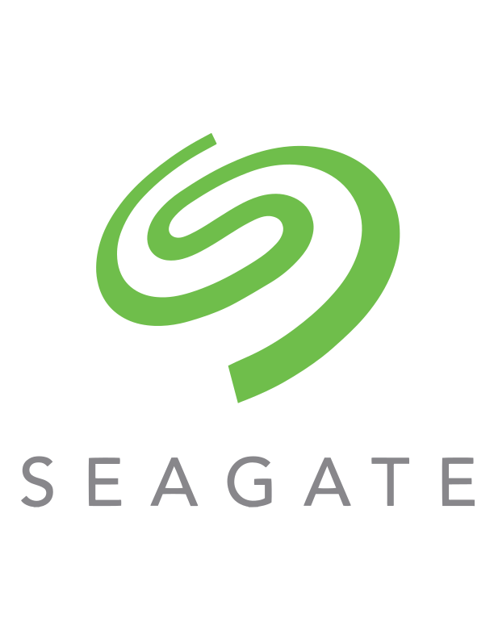
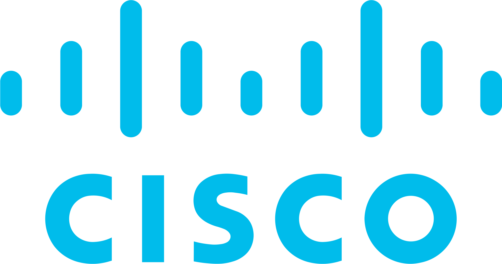

<!--
    Hey there, I'm Akhil Jose!
    Happy to see you here exploring my README code
    Feel free to inspire!
    
    But may I please ask you to follow me in return? Just a click!
    You may also want to connect with me on LinkedIn @akhiljose22
-->

 

<!--
    ABOUT MYSELF
-->

<h2 align="center">⚡ About Me</h2>

🧑‍💻 **Result-Oriented Professional**: With expertise in Azure, DevOps practices, and AI frameworks like PyTorch, I specialize in designing secure, scalable solutions that meet industry standards and address real-world challenges. My professional journey includes managing Bank of America’s network infrastructure as a Network Analyst for Cisco and leading the migration of Cisco enterprise systems to Zoom at Seagate Malaysia.  

🎓 **Lifelong Learner**: Proficient in Python, SQL, Vue, and networking technologies, I constantly evolve by exploring emerging trends in cloud computing, security, and AI. Certified in CCNA and ITIL, I have recently completed a Cybersecurity program and am now focusing on integrating cloud security into scalable enterprise solutions.  

🎯 **Collaborative Leader**: As a Team Lead at Seagate, I motivated and guided my team to successfully complete the complex migration from Cisco infrastructure to Zoom. Additionally, I was recognized for outstanding leadership during my Cybersecurity program, particularly while leading a capstone project focused on resolving eCommerce payment issues. These experiences underscore my ability to inspire teams and deliver impactful results.  

🧠 **Driven Innovator**: Immersed in the world of cloud development, I am committed to merging networking expertise with machine learning technologies to develop transformative solutions. My passion for leveraging data and cloud architecture drives me to create secure, scalable applications that address real-world challenges.  

⚙️ **Visionary Problem-Solver**: Equipped with a practical understanding of Agile practices and a commitment to long-term impact, I am dedicated to advancing cloud computing and AI technologies. My work is focused on shaping the future of secure, connected ecosystems that deliver efficiency and innovation.  

<!--
     MY MISSION
-->

<h2 align="center">🧭 My Mission</h2>

Focused on advancing in DevOps engineering and cloud security, with a particular emphasis on safeguarding sensitive systems like those in banking, I aim to address the increasing risks in cloud environments. By leveraging full-stack Cloud native development and AI, I am building innovative solutions, including a credit card monitoring system, to enhance security and deliver impactful, scalable results in the tech industry.

<!--
     MY VISION
-->

<h2 align="center">👁️ My Apogee</h2>

As cloud computing continues to drive the future of industries globally, security remains a critical concern due to inherent vulnerabilities. I am committed to advancing the field by developing robust, secure, and reliable cloud solutions. Through the integration of AI-driven automation, I aim to create systems capable of autonomously identifying and mitigating security flaws, ensuring a resilient and secure cloud infrastructure that meets the evolving demands of modern businesses.

<h2 align="center">🌟 My GitHub Profile</h2>

<h3 align="center">Git Stats</h3>

  
   
  

 

<table>
  <tr>
    <td>
      
    </td>
    <td>
     
    </td>
  </tr>
</table>

<h3 align="center">Top Repositories</h3>

  <table>
    <tr>
      <td>
        
      </td>
      <td>
        
      </td>
    </tr>
    <tr>
      <td>
        
      </td>
      <td>
        
      </td>
    </tr>
    <tr>
      <td>
        
      </td>
    </tr>
  </table>

<h3 align="center">Github Contribution Chart</h3>

<!--
     This is the list of my skills and tools I am studying!
-->

<h2 align="center">🏆 Upcoming Project</h2>

<h3 align="center">On its Way....</h3>

### Main skills
### Full Stack Cloud-Native Development

#### Frontend

#### Backend  
 

#### Database 

#### Cloud Computing & DevOps

#### Networking  

  
  
  
  

#### Exposure

<h2 align="center">🧑‍💼 Professional Experience</h2>

### Unified Communication Engineer

<strong>Seagate Technology, Bayan Lepas, Penang, Malaysia</strong>

January 2022 – September 2023

*	Spearheaded a migration project to transition Seagate's network infrastructure from Cisco systems to Zoom Cloud Infrastructure, enhancing communication capabilities.
*	Collaborated with cross-functional teams to support the implementation of the Zoom Cloud Telecommunication System, improving system reliability by 25%.
*	Provided technical support and troubleshooting for Zoom services, resolving issues promptly to minimize downtime and improve user satisfaction.
*	Conducted training sessions for staff on the new communication tools, resulting in a 30% increase in user adoption within the first month.

### Cisco Analyst

<strong>Cisco Systems, Noida, New Delhi, India</strong>

February 2020 – December 2021

*	Managed the network infrastructure for Bank of America, ensuring optimal performance and security of enterprise communication systems.
*	Supported CUCM and Webex cloud services, improving communication efficiency by reducing latency issues by 20%.
*	Developed and implemented monitoring tools to track network performance, leading to a 15% reduction in incident response time.
*	Collaborated with the engineering team to identify and resolve complex technical issues, contributing to a 40% improvement in service-level agreements (SLAs).

#### CERTIFICATIONS

*	CCNA Routing & Switching
*	ITIL Certification

  
  

You can find my publications on Medium and Dev.to, where I share career insights, tips, and my knowledge and experience in tech.
I also delve into personal thoughts and research on AI, quantum computing and other interesting topics.
Check out my latest post 👇 
  
 

<!--
     Fast links to my socials!
-->

### Connect with me!

    
    
    
    
    

<!--
     Oh, hello there, recruiters!
-->

### Employer?
> [!IMPORTANT]  
> <a href="https://drive.google.com/drive/folders/1hJGhQTtzDUzMqRtoIQUx7QTLtCN726ZK?usp=sharing" download>Download my resume</a>

<!--
     Thanks for being my guest <3
-->
